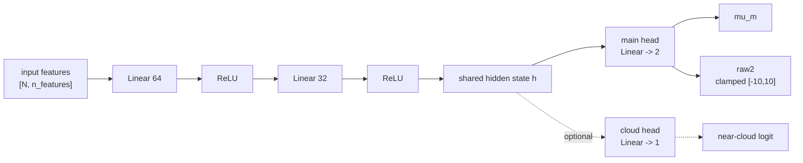
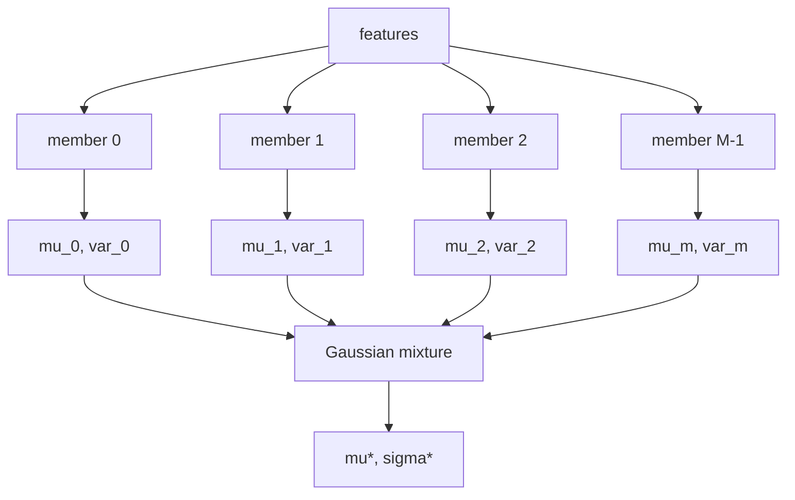
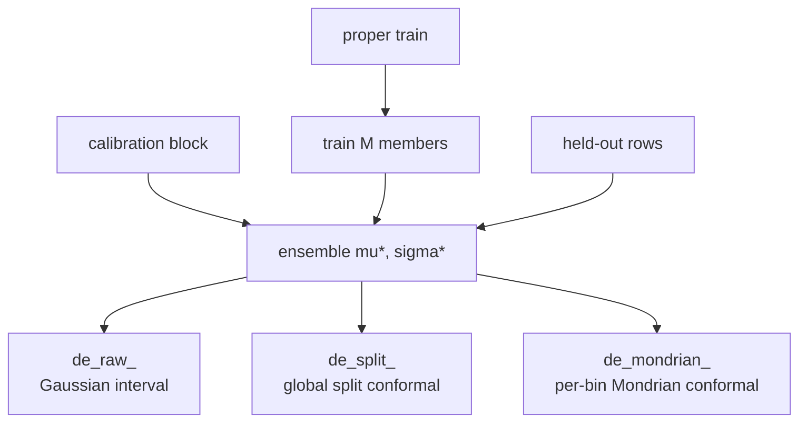

# Deep Ensemble MLP Architecture

Source of truth: [`deep_ensemble.py`](deep_ensemble.py).  Manuscript schematic:
[`make_deep_ensemble_figure.py`](make_deep_ensemble_figure.py), which uses the
shared AMT figure style from `workspace/plot_style.py` (Arial text/mathtext,
thin lines, 300 dpi raster output plus vector PDF).

The model predicts an OCO-2 bias correction and its uncertainty:

1. **Point correction**: ensemble mean `mu*`.
2. **Predictive spread**: mixture variance from aleatoric head variance plus
   epistemic member disagreement.
3. **Calibrated 90% intervals**: raw Gaussian, global split conformal, and
   Mondrian conformal intervals written from the same `mu*`.

Reference: Lakshminarayanan et al. 2017, *Simple and Scalable Predictive
Uncertainty Estimation using Deep Ensembles*.

---

## 1. One Member: `GaussianMLP`

Each member is a small feed-forward network with a two-output probabilistic
head.  The default body is `n_features -> 64 -> ReLU -> 32 -> ReLU`, controlled
by `--hidden_dims`.



Main-head interpretation depends on `--loss`:

| Loss | Default? | `raw2` means | Purpose |
|---|---:|---|---|
| `beta_nll` | yes | `log_var` | Production loss; Seitzer-style variance weighting keeps mean fitting from being suppressed in high-variance rows. |
| `gaussian_nll` | no | `log_var` | Plain Gaussian negative log-likelihood. |
| `student_t` | no | `log_scale` | Heavy-tailed residual model; variance uses fixed `--nu` (>2). |

Optional regularization:

| Option | Default | Effect |
|---|---:|---|
| `--dropout` | `0.0` | Dropout after each activation during training only. Inference does not use MC dropout; ensemble spread supplies epistemic uncertainty. |
| `--norm` | `none` | Optional `layer` or `batch` normalization after each hidden linear layer. |
| `--cloud_aux_weight` | `0.0` | Adds an auxiliary near-cloud classifier head and `lambda * BCE` loss. When zero, checkpoints/state dicts are identical to the single-task architecture. |

Near-cloud rows are defined by `cld_dist_km <= --near_cloud_km` (default
10 km).  `--near_cloud_weight > 1` upweights those rows in both proper-train
and calibration batches used for early stopping.

---

## 2. Ensemble Mixture

`--n_members` independent members are trained with seeds `seed + m`.  By
default all members share `--hidden_dims`.  `--member_archs` enables a DE++
style heterogeneous ensemble by cycling through a semicolon-separated list of
member widths, for example `64,32;128,64;256,128,64`.



`ensemble_predict` accumulates running moments rather than materializing an
`[M, N]` prediction stack:

```text
mu*      = mean_m(mu_m)
var*     = mean_m(var_m + mu_m^2) - mu*^2
sigma*   = sqrt(max(var*, 1e-12))
raw 90%  = mu* +/- 1.6448536269514722 * sigma*
```

`mean_m(var_m)` is the aleatoric component.  Member disagreement in `mu_m` is
the epistemic component.  If the optional cloud head exists, `ensemble_cloud_prob`
averages `sigmoid(cloud_logit_m)` and reports near-cloud AUC/AP when truth is
available.

---

## 3. Inputs and Splits

The end-to-end run uses:

1. Load parquet/CSV data and filter by `sfc_type`.
2. Keep snow by default; `--exclude_snow` removes snow/ice footprints.
3. Resolve the target (`10km`, `15km`, or `5km`) and filter target outliers.
4. Split into train and held-out data via `split_dataframe`.
5. Carve `--calib_frac` (default 0.15) out of train as a calibration block,
   preferring date splits when possible.
6. Fit `FeaturePipeline` on proper-train only, then transform proper-train,
   calibration, and held-out rows.

Optional cloud-distance bin feature:

| `--cloud_bin_feature` | Meaning |
|---|---|
| `none` | Default; no extra feature. |
| `oracle` | Append true `cld_dist_km` bin one-hot: `[0,2)`, `[2,5)`, `[5,10)`, `[10,15)`, `[15,inf)` km. |
| `predicted` | Train an internal GBDT classifier on the same features and append predicted cloud-distance bin one-hot. |

The training-date manifest (`training_dates.json`) is written for downstream
TCCON leakage checks.

---

## 4. Training

Each member is trained by `_train_member` through `train_common.train_model`:

| Component | Current behavior |
|---|---|
| Optimizer/schedule | Defined in `train_common`: AdamW, OneCycleLR, gradient clipping, early stopping. |
| Early stopping validation | The calibration block, held out from proper training. |
| Platform defaults | Resolved by `TrainConfig` (for example Darwin favors smaller epoch/batch defaults than Linux). |
| Device | Auto-selection through `train_common.select_device` (CUDA, MPS, then CPU). |
| GPU residency | `--gpu_resident auto/on/off` controls whether tensors stay resident on device. |

---

## 5. Conformal Calibration

All interval variants share the same `mu*`; only interval widths differ.



| Output tag | Method | Notes |
|---|---|---|
| `de_raw_<split>` | Raw Gaussian mixture | `mu* +/- Z90 * sigma*`; no recalibration. |
| `de_split_<split>` | Split conformal | One residual quantile for all rows. |
| `de_mondrian_<split>` | Mondrian conformal | Per-bin residual quantiles; default bins are predicted-mean deciles (`--mondrian_col mu`). |

`--mondrian_col` can use an observable physical column such as `cld_dist_km` or
`aod_total`.  `--near_cloud_target` raises coverage only in near-cloud Mondrian
bins and therefore requires `--mondrian_col cld_dist_km`.

All intervals are monotone by construction (`crossing_rate = 0`).

---

## 6. Artifacts

Each run writes the model, predictions, diagnostics, and metadata under
`results/model_deep_ensemble/<suffix>` or `results/model_deep_ensemble`.

| Artifact | Purpose |
|---|---|
| `member_*.pt` | Trained PyTorch member checkpoints. |
| `deep_ensemble_pipeline.pkl` | Fitted feature pipeline. |
| `deep_ensemble_meta.pkl` | Feature count, member count, conformal quantiles/edges, loss, cloud options, member architectures, and train config. |
| `training_dates.json` | Train/calibration/held-out date manifest for leakage checks. |
| `held_out_predictions.parquet` | Held-out `y_true`, `mu`, `sigma`, Mondrian interval, and selected physical columns. |
| `de_*_<split>_metrics.json` | Global diagnostics for raw/split/Mondrian intervals. |
| `de_*_<split>_stratified.csv` | Stratified diagnostics from `diagnostics.stratified_metrics`. |
| `de_correction_clddist_<split>.csv` | Correction effectiveness by cloud-distance bin. |
| `run_summary.json` | Tracking summary with primary/secondary metrics and config. |

---

## 7. Manuscript Figure

Generate AMT/manuscript-ready schematics with Arial text/mathtext:

```bash
python -m src.models.make_deep_ensemble_figure --dpi 300 --formats pdf,png
```

Default outputs:

| File stem | Meaning |
|---|---|
| `deep_ensemble_architecture` | Full schematic including the optional auxiliary cloud head. |
| `deep_ensemble_architecture_no_cloud` | Single-task schematic matching runs with `--cloud_aux_weight 0`. |

The script exposes:

| Option | Default | Meaning |
|---|---:|---|
| `--out-dir` | `results/figures` | Output directory. |
| `--dpi` | `300` | Raster DPI for PNG/TIFF outputs. |
| `--formats` | `pdf,png` | Comma-separated formats. |
| `--only` | `both` | `both`, `cloud`, or `no-cloud`. |

---

## Glossary

| Symbol | Meaning |
|---|---|
| `mu_m` | Mean prediction from ensemble member `m`. |
| `var_m` | Predictive variance from member `m` after converting `raw2`. |
| `mu*` | Ensemble mean correction. |
| `sigma*` | Ensemble predictive standard deviation. |
| aleatoric | Data/noise uncertainty represented by per-member variance heads. |
| epistemic | Model uncertainty represented by member disagreement. |
| Mondrian conformal | Split conformal calibration with a separate quantile per bin. |
