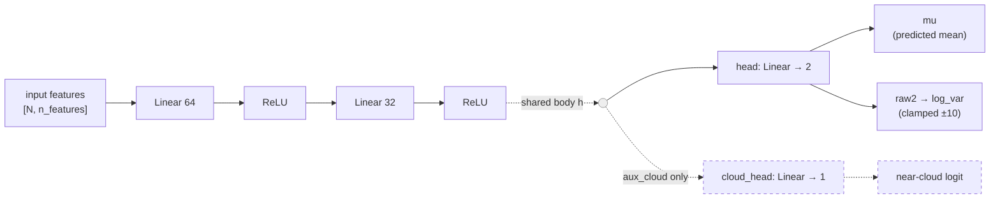
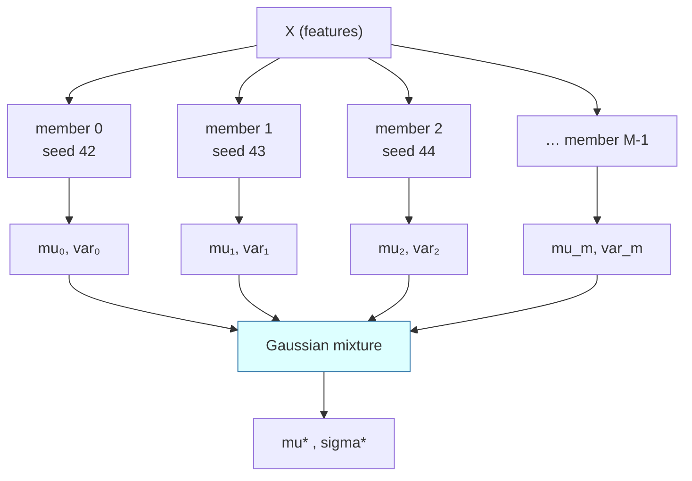
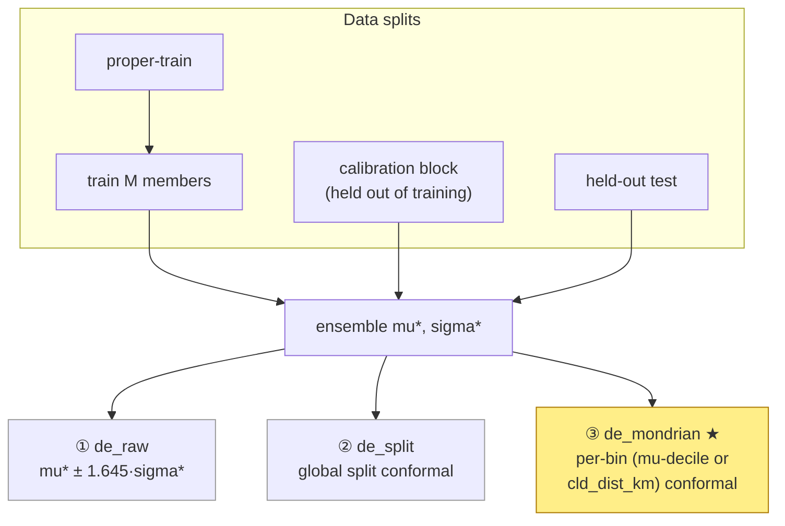
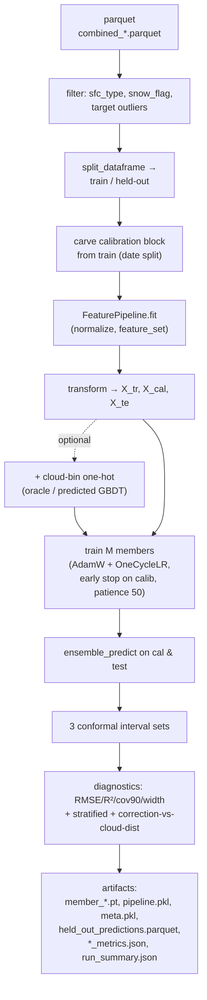

# Deep Ensemble MLP — Model Structure

Visual reference for [`deep_ensemble.py`](deep_ensemble.py). Reference: Lakshminarayanan et al. 2017, *Simple and Scalable Predictive Uncertainty Estimation using Deep Ensembles* (NeurIPS).

The model does two jobs:
1. **Point prediction** — a corrected XCO2 anomaly `mu*` (RMSE / R² leader).
2. **Calibrated intervals** — a 90% prediction interval that is honest even in the near-cloud tail, via conformal recalibration.

---

## 1. One member — `GaussianMLP`

Each member is a small MLP with a **Gaussian head**: it predicts a mean *and* a variance, trained by negative log-likelihood (not MSE), so it says how unsure it is per-sounding.



- **Body**: `n_features → 64 → ReLU → 32 → ReLU` (widths configurable via `--hidden_dims`, e.g. `128,64,32`).
- **Main head** → `(mu, raw2)`. `raw2` is read as `log_var` (gaussian / beta_nll) or `log_scale` (student_t) depending on the loss — architecture is identical so checkpoints are interchangeable.
- **Optional aux cloud head** (`--cloud_aux_weight > 0`): a second linear head off the *shared* body predicting the binary near-cloud label. Multi-task signal that injects cloud-contamination structure into the representation. When off, the state_dict is identical to the single-task model.

### Loss options (`--loss`)
| Loss | Head output | Use |
|------|-------------|-----|
| `gaussian_nll` | log_var | default |
| `beta_nll` (Seitzer 2022) | log_var | restores mean-fit gradient in high-variance near-cloud rows |
| `student_t` | log_scale | heavy tails for the near-cloud residual tail |

Optional per-sample weighting `w` (`--near_cloud_weight`) tilts the objective toward near-cloud rows so the far-cloud majority (~81%) doesn't dominate the gradient.

---

## 2. The ensemble — M independent members

`M` members (`--n_members`, default 5) are trained **independently** with different seeds (`seed + m`). Optionally heterogeneous architectures (`--member_archs`, "DE++") to decorrelate members further.



**Mixture formulas** (`ensemble_predict`):

```
mu*   = mean_m( mu_m )
var*  = mean_m( var_m + mu_m² ) − mu*²      # aleatoric + epistemic
90% raw interval:  mu* ± 1.645 · sqrt(var*)  # Gaussian approx
```

- `mean(var_m)` → **aleatoric** (data noise, from each head).
- spread of `mu_m` → **epistemic** (model disagreement).

If members have cloud heads, `ensemble_cloud_prob` averages `sigmoid(logit)` → an ensemble near-cloud probability (AUC/AP reported).

---

## 3. Conformal calibration — making intervals honest

The raw Gaussian interval is not guaranteed to cover 90%. A **calibration block** carved from TRAIN (`--calib_frac`, date-split when possible) recalibrates the intervals. Three interval variants are produced from the *same* `mu*` (so RMSE/MAE/R² are identical across them — only the intervals differ):



| Tag | Method | Notes |
|-----|--------|-------|
| `de_raw_<split>` | raw Gaussian mixture | no recalibration |
| `de_split_<split>` | global split conformal | one quantile `q` for all rows |
| **`de_mondrian_<split>`** | Mondrian (binned) conformal ★ | **headline** — per-bin `q`, bins by `--mondrian_col` (`mu` deciles, or a physical proxy like `cld_dist_km` / `aod_total`) |

Mondrian bins let the near-cloud regime get its own quantile. `--near_cloud_target` can raise coverage in the near-cloud bins only (over-cover the outcome-defined tail). All intervals are monotone by construction (`crossing_rate = 0`).

---

## 4. End-to-end run flow (`main`)



**Key training config**: optimizer `AdamW` (lr 1e-3, wd 1e-4), `OneCycleLR` schedule, grad-clip 1.0, early stopping on the calibration block (patience 50). Platform defaults: Darwin 100 epochs / batch 2048, Linux 500 / 4096. Device auto: CUDA → MPS → CPU.

---

## Quick glossary

| Symbol | Meaning |
|--------|---------|
| `mu*` | ensemble mean prediction (the correction) |
| `sigma*` | ensemble predictive std (aleatoric + epistemic) |
| `raw2` | head's 2nd output → `log_var` or `log_scale` |
| `M` | number of ensemble members (`--n_members`) |
| aleatoric | irreducible data noise (per-head variance) |
| epistemic | model uncertainty (member disagreement) |
| Mondrian | conformal with a separate quantile per bin |
